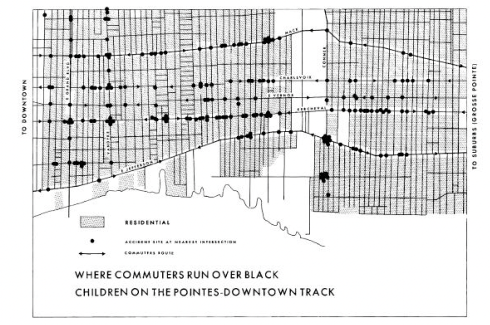
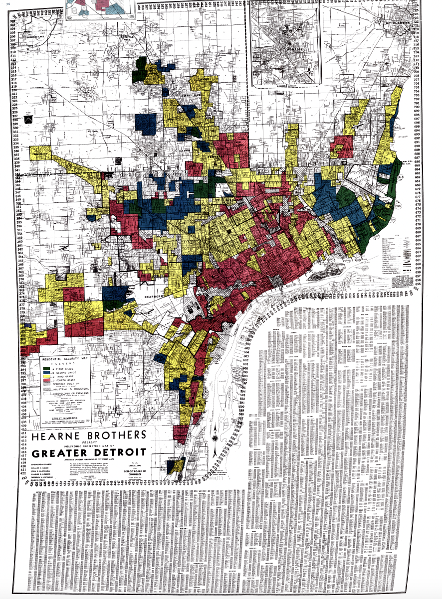

# Data Visualization Report
## By Lufei Chen
*July 12, 2023*

## Data Viz Summary

> The people who lived along the deadly route had long recognized the magnitude of the problem, as well as its profound impact on the lives of their friends and neighbors.

This map visually maps aspects of the urban environment related to race and children. The black dots mark each location in the community where white drivers killed black children. The number of the black dots on the map is staggering, with their frequency covering entire neighborhoods.
This visualization is a stark illustration of prevalent racial disparities, violence, and injustices of the era。 It portrays a dismissive attitude by laws toward black lives' safety, permitting the ruin of black children's lives by white drivers. Hence, it unmasks the deeply ingrained racial bias against black children in Detroit.

## Data Viz Biography

**1. Who or what institution produced the visualization? (Hint: refer to "Figure Credits")**  
Created by the Detroit Chamber of Commerce and the Federal Home Loan Bank Board.
Robert K. Nelson, LaDale Winling, Richard Marciano, and Nathan Connolly map the redlining. 

**2. When was it produced?**  
1939

**3. Who is the audience for the visualization?**  
Banks, lending institutions, Detroiters, and academics who are interested in this.

**4. How might the visualization be interpreted or misinterpreted? What consequences might this interpretation/misinterpretation have?**  
The redlining map shows discrimination. It shows that segregated areas lead to stark economic disparities between races. Redlining map of Detroit is also subject to potential misunderstandings. Using color-coded zones oversimplifies reality, forcing blacks in red zones to have the same experiences and thus to be rejected by lending banks with equal probability.

**5. How, if at all, does the data visualization represent power or systems?**  
The redlining map marked illustrates a city characterized by systemic racial disparities. Black in communities are relegated to redlined areas, classified as high-risk investment zones, and are often denied loans by financial institutions. And it was created by a federal agency that emphasized authority and system. It also underscores the persistence of apartheid. This power influenced the economic gap between blacks and whites to become wider and wider.

😈
[Google](https://www.google.com)
